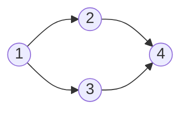

# BFS / 幅優先探索

**難易度**: Medium

## 概要

グラフの開始ノードから、距離（ホップ数）が近い順にすべての到達可能なノードを訪問するアルゴリズム。キューを使って「現在の距離の全ノードを処理してから次の距離へ」という順序を保証する。最短経路（重みなし）探索にも応用される。

## アルゴリズムの直感

「波紋」のようにノードを広げていくイメージ。開始ノードを中心に、距離1のノードをすべて処理し、次に距離2のノードをすべて処理する。この順序を実現するのがFIFO（先入れ先出し）のキューである。

訪問済みセットを持つことで、閉路があっても同じノードを二度キューに積まない。これが無限ループを防ぐ核心である。

## 自分の解釈

DFSとの直感的な違いは「手元の選択肢を全部試してから次へ」（BFS）vs「一本道を深く潜ってから戻る」（DFS）。BFSは最短距離を保証するが、DFSは保証しない。

`Array.shift()` は O(n) のため、配列インデックス `head` をポインタとして使い `queue[head++]` でデキューすることで O(1) を実現している。末尾への `push` は O(1) なので、全体の計算量は O(V + E) を達成できる。

## 計算量

- 時間: O(V + E)（V: ノード数、E: 辺数）
- 空間: O(V)（visited セットとキューが最大 V 要素を保持）

## Example

```
グラフ:
  1 → [2, 3]
  2 → [4]
  3 → [4]
  4 → []
```



```
start = 1

Step 1: queue=[1], visited={1}
  処理: node=1, result=[1], キューに追加: [2, 3], visited={1,2,3}
Step 2: queue=[2, 3]
  処理: node=2, result=[1,2], キューに追加: [4], visited={1,2,3,4}
Step 3: queue=[3, 4]
  処理: node=3, result=[1,2,3], 4はvisited済みのためスキップ
Step 4: queue=[4]
  処理: node=4, result=[1,2,3,4], 隣接なし
Step 5: queue=[] → 終了

出力: [1, 2, 3, 4]
```

## 実装メモ

- `graph.get(node) ?? []` で隣接リストに存在しないノードを安全に扱う（TypeScript）
- Go では `map[int][]int` のゼロ値が `nil` であり、`range nil` は空ループになるため安全
- `visited.add(start)` をキューに積む前に行うことで、スタートノードが重複訪問されない

## 参考文献

- Cormen, T. H., Leiserson, C. E., Rivest, R. L., & Stein, C. (2022). *Introduction to Algorithms* (4th ed.), Section 20.2 "Breadth-first search". MIT Press.
