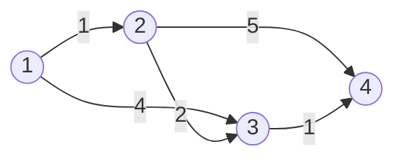

# Dijkstra / ダイクストラ法

**難易度**: Hard

## 概要

重み付き有向グラフ（辺の重みがすべて非負）において、単一始点から全ノードへの最短距離を求めるアルゴリズム。優先度キュー（最小ヒープ）を使って「現時点で最も距離が小さい未確定ノード」を効率的に選択し、最短距離を確定していく。

## アルゴリズムの直感

**なぜ貪欲法が成立するか**: 辺の重みがすべて非負である場合、一度「最短距離が確定した」ノードから先に進んでも、距離が増えることはあっても減ることはない。したがって、現時点で最も距離が小さいノードの距離は永久に最短であると確定できる。これが貪欲選択の正当性の根拠である。

負辺が存在する場合（例: -5 の辺）は、確定済みのノードへの距離が後から更新される可能性があるためこの論理が崩れる。その場合は Bellman-Ford アルゴリズムを使う必要がある。

## 自分の解釈

実装上の核心は「古いエントリのスキップ」: `if du > dist[u] { continue }`。同じノードが複数回ヒープに積まれることがあるが、より短い距離で確定済みならそのエントリは無効だとして読み飛ばす。これによって減少キー操作（decrease-key）なしにヒープを使える。

到達不可能ノードは距離が `Infinity`（TypeScript）/ `math.MaxInt`（Go）のまま更新されないため、ループ終了時にその値が残る。呼び出し側はこれを「到達不可能」のシグナルとして扱う。

## 計算量

- 時間: O((V + E) log V)（V: ノード数、E: 辺数、log V は最小ヒープの操作コスト）
- 空間: O(V + E)（距離マップとヒープが最大 V + E エントリを保持）

## Example

```
グラフ（重み付き有向）:
  1 →[1]→ 2
  1 →[4]→ 3
  2 →[2]→ 3
  2 →[5]→ 4
  3 →[1]→ 4
```



```
start = 1, 初期: dist={1:0, 2:∞, 3:∞, 4:∞}

Step 1: heap から (node=1, dist=0) を取り出す
  1→2: 0+1=1 < ∞ → dist[2]=1, heap に (2,1) を積む
  1→3: 0+4=4 < ∞ → dist[3]=4, heap に (3,4) を積む
  dist={1:0, 2:1, 3:4, 4:∞}

Step 2: heap から (node=2, dist=1) を取り出す
  2→3: 1+2=3 < 4 → dist[3]=3, heap に (3,3) を積む
  2→4: 1+5=6 < ∞ → dist[4]=6, heap に (4,6) を積む
  dist={1:0, 2:1, 3:3, 4:6}

Step 3: heap から (node=3, dist=3) を取り出す
  3→4: 3+1=4 < 6 → dist[4]=4, heap に (4,4) を積む
  dist={1:0, 2:1, 3:3, 4:4}

Step 4: heap から (node=4, dist=4) を取り出す → 隣接なし

Step 5: heap から (node=3, dist=4) を取り出す → du(4) > dist[3](3) のためスキップ

Step 6: heap から (node=4, dist=6) を取り出す → du(6) > dist[4](4) のためスキップ

出力: {1:0, 2:1, 3:3, 4:4}
```

## 実装メモ

- TypeScript では `container/heap` 相当の組み込みがないため、バイナリ最小ヒープを手実装した
- Go では標準ライブラリの `container/heap` インターフェースを実装することでヒープを使用した
- `collectNodes` で隣接リストに出現する全ノードを収集することで、到達不可能ノードへの Infinity 初期化を実現している
- `heap.Interface` を満たすには `Len / Less / Swap / Push / Pop` の5メソッドが必要。`Push / Pop` はポインタレシーバで定義する

## 参考文献

- Cormen, T. H., Leiserson, C. E., Rivest, R. L., & Stein, C. (2022). *Introduction to Algorithms* (4th ed.), Section 22.3 "Dijkstra's algorithm". MIT Press.
