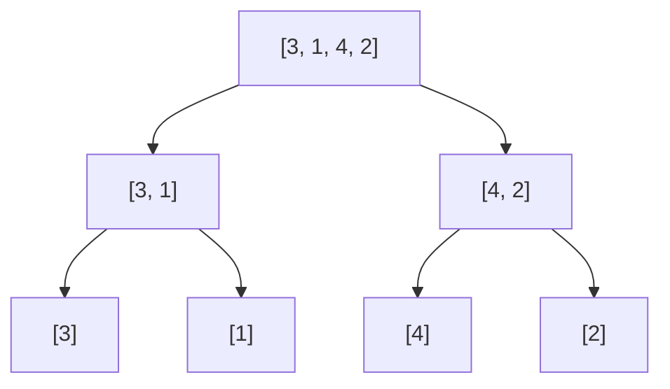

# Merge Sort / マージソート

**難易度**: Medium

## 概要

マージソートは分割統治法に基づく比較ソートアルゴリズムである。配列を再帰的に2分割し、最小単位（要素数1）まで分割してから「ソート済み2配列のマージ」操作で順番に結合する。安定ソートであり、最悪計算量も O(n log n) が保証される。

## アルゴリズムの直感

「大きな問題を解くために小さな問題に分割し、小さな問題の解を合わせて大きな解を作る」という分割統治の発想が核心。要素数1の配列は自明にソート済みであり（ベースケース）、2つのソート済み配列を1つのソート済み配列にマージする操作は O(n) で実現できる。この2点が成り立つため、分割を O(log n) 回繰り返すことで全体を O(n log n) でソートできる。

**安定ソートの性質**: マージ操作で同値の要素を比較する際に「左の配列を優先する（`left[i] <= right[j]`）」実装にすることで、元の相対順序が保持される。Sedgewick & Wayne (2011) は安定ソートをマージソートの主要な利点として挙げている。

## 自分の解釈

再帰の「戻る」フェーズでマージが起きることが分かりにくかった。「分割していくときはまだ何もしない、戻るときに初めてマージする」という順序を意識すると理解しやすい。木構造で考えると：葉ノードがベースケース、内部ノードがマージ操作に対応する。

クイックソートとの対比：クイックソートは「分割時に仕事をする（ピボットで正しい位置に振り分ける）」のに対し、マージソートは「結合時に仕事をする」。この違いがクイックソートの不安定ソートとマージソートの安定ソートの性質の違いに現れる。

## 計算量

- 時間: O(n log n)（最良・平均・最悪すべて）
- 空間: O(n)（マージ時に補助配列が必要）

## Example

入力: `[3, 1, 4, 2]`

分割フェーズ:



マージフェーズ:

```
[3] + [1] → [1, 3]   (1 < 3 なので1を先に取る)
[4] + [2] → [2, 4]
[1, 3] + [2, 4] → [1, 2, 3, 4]

Trace（最終マージ）:
i=0, j=0: left[0]=1 <= right[0]=2 → 1を取る, result=[1]
i=1, j=0: left[1]=3 > right[0]=2  → 2を取る, result=[1,2]
i=1, j=1: left[1]=3 <= right[1]=4 → 3を取る, result=[1,2,3]
i=2 (left終了): right残り[4]を追加 → result=[1,2,3,4]

出力: [1, 2, 3, 4]
```

## 実装メモ

- Go の `arr[:mid]` は元スライスと同じ基底配列を参照するが、再帰呼び出しでは参照せず新しいスライスを返すので問題ない
- TypeScript の実装では `arr.slice(i)` で残余要素を一括追加することで、末尾のループを省略できる
- `left[i] <= right[j]`（<=）で安定ソートが実現される。`<` にすると右側優先になり不安定ソートになる

## 参考文献

- Sedgewick, R., & Wayne, K. (2011). *Algorithms* (4th ed.), Section 2.2 Mergesort. Addison-Wesley Professional.
